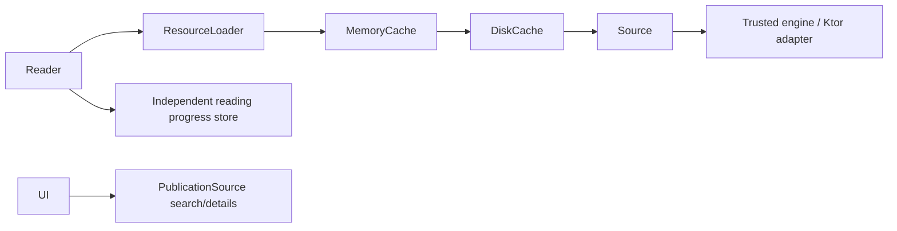

# Architecture

> A source obtains publications. A reader displays them. INFINILECT connects both.

## Foundation, search and bounded TEXT reading implemented today

Two modules are sufficient: `core` and `app`. Both use Kotlin Multiplatform source
sets, with JVM/desktop as the only configured targets. More targets and modules
will be introduced with working implementations, not empty placeholders.

`core/commonMain` contains Kotlin-only models and suspend contracts. It has no
Compose, Readium, Ktor, SQLDelight or platform dependency. `app/commonMain` owns the
search/TextReader UI and small Compose-free controllers using coroutines StateFlow.
`app/desktopMain` owns the launcher, GutenbergSource, Ktor Java transport and the
JDK StAX parser. The launcher injects PublicationSource through SearchController
and closes both configured sources at shutdown. The dependency direction is
`app → core`; core never refers to app.

InternetArchiveSource in desktopMain implements search, details and bounded
acquisition. The launcher supplies two explicit source choices: Gutenberg search
and public-CC0 Internet Archive text reading. One source/session is active at a
time; no registry or simultaneous search. Shared DirectResourceLoader and neutral
format selection are reused by the first TextReader and the existing prefix demo.
No cache/download store. HTTP/JSON, access gates and streaming
lifecycle stay in the desktop adapter. Core contracts are sufficient and unchanged.
See [ADR 0011](adr/0011-verified-source-acquisition.md).

## Domain

`SourceId` is a stable namespace. `PublicationId` is the structured pair of source
ID and local publication ID, so identical local IDs from different catalogs do
not collide. Do not flatten it with an unescaped separator in storage or URLs.
`PublicationType` describes meaning (BOOK, COMIC, MAGAZINE, ARTICLE, DOCUMENT).
`PublicationFormat` describes representation (EPUB, PDF, PAGES, HTML, TEXT).
A publication can offer multiple representations without changing semantic type.

`PublicationResource` is an opaque source-owned resource reference, with a
publication identity, unique resource key, format, media type and optional opaque
content revision. Known revisions produce a structured `ResourceCacheKey`; unknown
revisions never imply safe unconditional cache reuse. It is not a filesystem path
or a reader engine object. `Publication` enforces ownership and resource-key
uniqueness. Empty resources are valid for search metadata awaiting detail retrieval.
`PublicationSource` provides search, details and resource handles; its results must
carry its namespace. Pagination tokens belong to the source.
Source implementations must reject foreign identities and preserve coroutine
cancellation. When a resource has an expected revision, acquired bytes must match
it; a mismatch needs a refreshed reference or an error, never a write under the
old key. Transport/parser limits and richer errors belong to the first adapter.

The first slice also preserves `languages` (empty means unknown), `sourceUrl`
(optional publication detail/canonical URL) and `rights` (optional verbatim source
statement). These support language display, provenance and rights transparency.
Missing rights never imply permission or public-domain status. Adapters validate
URLs and normalize language tags; core rejects blank values but implements no URL
parser or complete language registry. Cover and summary are deferred: title and
authors suffice for the initial result list, without image acquisition or rich
text handling. See [ADR 0007](adr/0007-metadata-and-resource-identity.md).

## Future cache/progress flow (not implemented)



The application chooses a representation and reader implementation by format and
platform. A reader consumes publication metadata and `ResourceLoader`, never a
source adapter, OPDS parser, authentication client or catalog search interface.
The loader routes by SourceId and applies caching before its source fallback.
Sources return metadata; readers render it. Neither owns the other.

## Resource access

`loadResource` and `load` open a fresh, single-consumer `ResourceContent` handle.
It has a nullable nonnegative total `sizeBytes`, a suspend sequential `read` into
a caller-owned ByteArray, and an idempotent non-suspending `close`. A positive read
may be short, returns -1 at EOF, and must never return 0; zero-length reads return
0. Buffer bounds and read-after-close behavior are specified in the interface.
No whole-resource allocation, Ktor stream, JVM InputStream, seeking API or platform
file is part of core's boundary.

The caller closes each handle in `finally`, including after partial consumption,
errors and cancellation. Implementations release acquired I/O if opening fails,
propagate cancellation during reads, and make close abort/release I/O without
suspending or waiting for completion. An incomplete stream cannot become a complete
cache entry. Each cache hit must expose an independent cursor, not share a live handle.

For a small TEXT resource, a reader can explicitly opt into bounded materialization:

```kotlin
val bytes = loader.load(resource).readBytes(maxBytes = 2 * 1024 * 1024)
// Decode using the source's verified charset; UTF-8 only when established.
```

`readBytes` always closes, enforces the actual byte limit even with unknown or
understated size, and probes at most one byte beyond the limit. It preserves the
original read/cancellation error if cleanup also fails. Buffering is bounded;
small partial reads are accumulated without allocating a new chunk for each byte.
Large-resource consumers use `read` incrementally and close in `finally` instead.
Future EPUB/PDF/archive readers may spool to a platform-managed file and use their
engine's random access; this interface promises only sequential access. Introduce
any seek/range capability only with a concrete consumer and implementation.
See [ADR 0006](adr/0006-bounded-resource-access.md).

Ktor belongs in a concrete trusted source/transport implementation outside core.
SQLDelight is deferred until persistent data needs a schema. Readium is deferred
and must remain behind an Android-specific reader implementation; no Readium
objects or dependencies may cross into core or shared reader contracts.

External source definitions will be declarative data interpreted by trusted
engines, not downloaded code. See [Sources](SOURCES.md). Cache, explicit downloads
and progress have separate lifetimes; see [Cache](CACHE.md).

No complete reader framework, engine registry, persistence or cache implementation is
claimed by the current foundation. See the [ADRs](adr/README.md).

## Search slice

`SearchScreen → SearchController → PublicationSource → GutenbergSource → Ktor/OPDS`.
The same controller works with InternetArchiveSource; no duplicated search logic.
Shared UI observes Idle, Loading, Results, Empty and Error through StateFlow and
never parses XML or handles HTTP. Only submit/Next page actions initiate requests;
busy actions are ignored and the source serializes HTTP operations. Pagination
replaces the displayed page, keeping memory bounded; a failed next-page request
keeps the previous results and token for an explicit retry. Cancellation propagates
and restores the previous/idle state. No cache, retry loop or prefetcher is involved.

GutenbergSource is a trusted, desktop-specific adapter, not a core implementation
or an external plugin. It enforces feed, URL, timeout and XML limits. Detail and
acquisition methods validate source ownership and throw UnsupportedOperationException:
no false not-found result or fabricated resource bytes. See [Sources](SOURCES.md)
and [ADR 0009](adr/0009-gutenberg-search.md) for the deliberately limited capabilities.

## First end-to-end TEXT reading slice

```text
SearchScreen → SearchController → PublicationSource.search
explicit Open text → OpenPublicationController → PublicationSource.getPublication
→ selectResource(TEXT) → DirectResourceLoader → PublicationSource.loadResource
→ ResourceContent → bounded strict UTF-8 loading → TextDocument → TextReader
```

Only Internet Archive currently enables Open text; Gutenberg remains search-only.
The opener verifies detail identity and selects the first advertised TEXT resource
with the existing source-neutral helper. No PDF/EPUB fallback. Acquisition still
refreshes permissions/location metadata within InternetArchiveSource; its public
CC0 scope, fail-closed redirects, 64 MiB source cap and null revisions are unchanged.

The app-level **512 KiB** document cap is separate and lower. Require a known,
positive stable size, allocate one size+1 payload buffer, read sequential chunks
of at most 8 KiB, verify exact EOF/declared length, and probe at most one excess
byte. Unknown/changed/oversized sizes, short/long streams or invalid read counts
fail safely. Close in finally on success, failure and cancellation, preserving
the primary error if cleanup fails. The handle is closed before strict UTF-8
decoding on Dispatchers.Default. Strip exactly one leading UTF-8 BOM; preserve
interior BOMs. Empty/whitespace/NUL-bearing text is not shown as a readable document.
No chunk-list/payload concatenation or unbounded read; decoding necessarily
creates the final bounded String. TextDocument contains only ID, title and text.

OpenPublicationController owns a job in the session's UI scope and exposes
Idle/Loading/Ready/Error. Ignore duplicate Open while Loading, bound the whole
operation to 60s, propagate cancellation and use an operation generation to
prevent stale Ready/Error after Back. Errors are fixed safe messages; no transport
exceptions/URLs/paths pass to the UI. TextReader receives only TextDocument and a
Back callback, with title, plain text and vertical scroll.

ReadingSession owns one SearchController, opener, query and search job. UI-thread
actions are serialized by the UI dispatcher; decoder work returns to that scope
before state publication. Open state doubles as the two-screen navigation state:
Idle = Search, Loading/Error = opening screen, Ready = Reader. Back resets only
opening state and keeps source/query/results; it does not refetch. Switching
source closes/discards the old session, creates a fresh one and resets Compose
collectors using a session key, so old-source results cannot flash or replace new
results. No request is started by changing source. Disposal cancels session jobs
and closes desktop sources. Query/results are session-local; no position/history
or content cache. See [ADR 0012](adr/0012-bounded-text-reading.md).

## Acquisition verification and lifecycle

OAPEN REST access remains blocked, but official OAI metadata with download links
is accessible; actual PDF transfer is still unverified. Preserve the original
[ADR 0010](adr/0010-oapen-verification-gate.md) finding and see
[ADR 0011](adr/0011-verified-source-acquisition.md) for the verified Archive route.
Both OAPEN diagnostics remain independent opt-in tasks, not source implementations.

The neutral consumer uses ResourceLoader, selects a caller-supported format and
closes its prefix-test handle. Archive validates ownership/fresh permissions and
opens a sequential HTTP stream. Its producer keeps Ktor's public scoped streaming
response alive until close/cancellation; close aborts without waiting for transfer
or materializing the file. A later consumer must open a fresh handle. No cache,
registry or simultaneous-source search is introduced. The later bounded
TextReader uses a fresh handle and consumes the entire eligible small resource;
the historical prefix check remains independent.

## Evolution when Android is added (no modules added now)

Keep the two current modules until a working Android entry point needs more.
Follow JetBrains' [AGP 9 migration guidance](https://www.jetbrains.com/help/kotlin-multiplatform-dev/multiplatform-project-agp-9-migration.html)
and [module configuration guidance](https://www.jetbrains.com/help/kotlin-multiplatform-dev/multiplatform-project-configuration.html):

1. Turn today's `app/commonMain` into a shared UI library, named `sharedUi`.
2. Move `app/desktopMain/Main.kt`, the desktop application plugin configuration,
   OS runtime dependency, desktop Gutenberg transport/parser and packaging into
   `desktopApp`, depending on `sharedUi`. Choose an Android transport/parser only
   when that target is added; JDK StAX is not shared Kotlin code.
3. Add `androidApp` for Activity, manifest, lifecycle, permissions and application
   packaging, depending on `sharedUi`. Use the Android-KMP library plugin for
   Android targets in shared libraries; do not combine `com.android.application`
   with the Kotlin Multiplatform plugin in a shared module under AGP 9.
4. Keep `sharedUi → core`; both platform apps consume shared UI. Configure core's
   additional target at that point without adding Android APIs to its common code.
   Android-only Readium objects and adapters stay behind the Android reader boundary.

Shared UI source/package boundaries already allow this move without changing the
domain API. No launchers, Android plugins, empty modules or packaging changes are
introduced in this pass. See [ADR 0008](adr/0008-platform-entrypoints.md).
