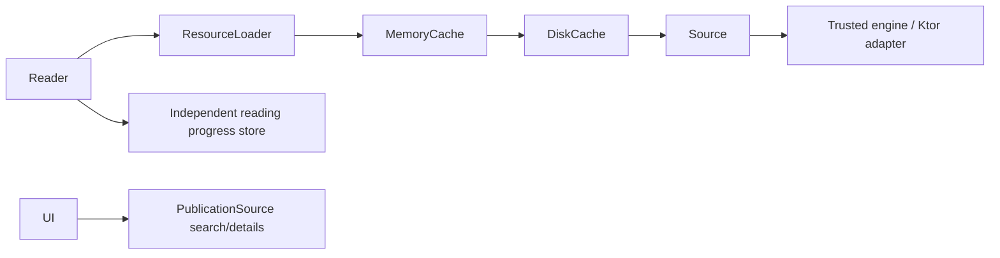

# Architecture

> A source obtains publications. A reader displays them. INFINILECT connects both.

## Foundation, search and bounded TEXT reading implemented today

Four modules now have concrete consumers: `core`, `app` (shared KMP library),
`desktopApp` and `androidApp`. The dependency direction is both launchers → app →
core. No empty registry/engine/navigation modules. Keeping the established `app`
name avoids an unnecessary rename; it no longer packages a Desktop application.

`core/commonMain` remains Kotlin-only models/suspend contracts, without Compose,
Readium, Ktor, SQLDelight or Android APIs. JVM and Android are build targets, not
platform code in the domain. `app/commonMain` owns the same shared Compose UI,
ReadingSession, SearchController, opener, TextDocument and TextReader.

`app/jvmSharedMain` is explicitly shared by Desktop and Android: Java-compatible
URI/Base64 validation, metadata/OPDS mapping, Ktor engine-independent transport
and acquisition rules. These APIs are supported at minSdk 26. This is not a claim
that JVM source code works on iOS. `desktopMain` supplies Ktor Java and JDK StAX;
`androidMain` supplies Ktor Android (HttpURLConnection) and platform XmlPull.
Both share one OPDS mapping/limits implementation through a tiny XML-token seam.
OAPEN diagnostics and live CLI checks remain Desktop-only.

`desktopApp` owns Window/application/OS runtime. `androidApp` owns MainActivity,
manifest/insets/Android Back and APK packaging. Neither owns source policies.
Platform factories create ApplicationSources without initiating requests. It
attaches the active ReadingSession and cancels it before closing both clients,
idempotently. Composition disposal detaches/cancels sessions; Activity destruction
and Desktop disposal close sources. No Activity/Context is retained by adapters.

The same UI offers Gutenberg search-only and public-CC0 Internet Archive TEXT
reading, one explicitly selected source at a time. No simultaneous search or
registry. The application injects a disk-caching ResourceLoader before
DirectResourceLoader; neutral format selection remains unchanged. No download store.
Core contracts and Archive access/redirect/revision limits
are unchanged. See [ADR 0013](adr/0013-first-android-application.md).

Result-list UI keys project PublicationId to Pair<String, String>: source and
local ID remain distinct, while the JVM/Android pair is serializable for Android
Bundle saveability. Core identities stay platform-free; this UI key is not a
persisted cache key and does not introduce session persistence.

## Domain

`SourceId` is a stable namespace. `PublicationId` is the structured pair of source
ID and local publication ID, so identical local IDs from different catalogs do
not collide. Do not flatten it with an unescaped separator in storage or URLs.
`PublicationType` describes meaning (BOOK, COMIC, MAGAZINE, ARTICLE, DOCUMENT).
`PublicationFormat` describes representation (EPUB, PDF, PAGES, HTML, TEXT).
A publication can offer multiple representations without changing semantic type.

`PublicationResource` is an opaque source-owned resource reference, with a
publication identity, unique resource key, format, media type and optional opaque
content revision. Known revisions produce a structured `ResourceCacheKey`; unknown
revisions never imply safe unconditional cache reuse. It is not a filesystem path
or a reader engine object. `Publication` enforces ownership and resource-key
uniqueness. Empty resources are valid for search metadata awaiting detail retrieval.
`PublicationSource` provides search, details and resource handles; its results must
carry its namespace. Pagination tokens belong to the source.
Source implementations must reject foreign identities and preserve coroutine
cancellation. When a resource has an expected revision, acquired bytes must match
it; a mismatch needs a refreshed reference or an error, never a write under the
old key. Transport/parser limits and richer errors belong to the first adapter.

The first slice also preserves `languages` (empty means unknown), `sourceUrl`
(optional publication detail/canonical URL) and `rights` (optional verbatim source
statement). These support language display, provenance and rights transparency.
Missing rights never imply permission or public-domain status. Adapters validate
URLs and normalize language tags; core rejects blank values but implements no URL
parser or complete language registry. Cover and summary are deferred: title and
authors suffice for the initial result list, without image acquisition or rich
text handling. See [ADR 0007](adr/0007-metadata-and-resource-identity.md).

## Cache pipeline and independent user progress



The application chooses a representation and reader implementation by format and
platform. A reader consumes publication metadata and `ResourceLoader`, never a
source adapter, OPDS parser, authentication client or catalog search interface.
The loader routes by SourceId and applies caching before its source fallback.
Sources return metadata; readers render it. Neither owns the other.

The first disk tier is implemented in app/jvmSharedMain; MemoryCache remains
deferred. Persistent reading progress is a separate user-state store. Only stable-revision resources may reuse bytes. Current Archive
null revisions bypass disk lookup/fills and retain fresh metadata/acquisition.
Platform factories choose app-private storage, inject loaders and own closing after
session cancellation. See [CACHE.md](CACHE.md) and [ADR 0014](adr/0014-persistent-resource-cache.md).

## Resource access

`loadResource` and `load` open a fresh, single-consumer `ResourceContent` handle.
It has a nullable nonnegative total `sizeBytes`, a suspend sequential `read` into
a caller-owned ByteArray, and an idempotent non-suspending `close`. A positive read
may be short, returns -1 at EOF, and must never return 0; zero-length reads return
0. Buffer bounds and read-after-close behavior are specified in the interface.
No whole-resource allocation, Ktor stream, JVM InputStream, seeking API or platform
file is part of core's boundary.

The caller closes each handle in `finally`, including after partial consumption,
errors and cancellation. Implementations release acquired I/O if opening fails,
propagate cancellation during reads, and make close abort/release I/O without
suspending or waiting for completion. An incomplete stream cannot become a complete
cache entry. Each cache hit must expose an independent cursor, not share a live handle.

For a small TEXT resource, a reader can explicitly opt into bounded materialization:

```kotlin
val bytes = loader.load(resource).readBytes(maxBytes = 2 * 1024 * 1024)
// Decode using the source's verified charset; UTF-8 only when established.
```

`readBytes` always closes, enforces the actual byte limit even with unknown or
understated size, and probes at most one byte beyond the limit. It preserves the
original read/cancellation error if cleanup also fails. Buffering is bounded;
small partial reads are accumulated without allocating a new chunk for each byte.
Large-resource consumers use `read` incrementally and close in `finally` instead.
Future EPUB/PDF/archive readers may spool to a platform-managed file and use their
engine's random access; this interface promises only sequential access. Introduce
any seek/range capability only with a concrete consumer and implementation.
See [ADR 0006](adr/0006-bounded-resource-access.md).

Ktor belongs in a concrete trusted source/transport implementation outside core.
SQLDelight is deferred until persistent data needs a schema. Readium is deferred
and must remain behind an Android-specific reader implementation; no Readium
objects or dependencies may cross into core or shared reader contracts.

External source definitions will be declarative data interpreted by trusted
engines, not downloaded code. See [Sources](SOURCES.md). Cache, explicit downloads
and progress have separate lifetimes; see [Cache](CACHE.md).

No complete reader framework, engine registry or downloads are
claimed. The bounded disk tier is documented separately. See the [ADRs](adr/README.md).

## Search slice

`SearchScreen → SearchController → PublicationSource → GutenbergSource → Ktor/OPDS`.
The same controller works with InternetArchiveSource; no duplicated search logic.
Shared UI observes Idle, Loading, Results, Empty and Error through StateFlow and
never parses XML or handles HTTP. Only submit/Next page actions initiate requests;
busy actions are ignored and the source serializes HTTP operations. Pagination
replaces the displayed page, keeping memory bounded; a failed next-page request
keeps the previous results and token for an explicit retry. Cancellation propagates
and restores the previous/idle state. No cache, retry loop or prefetcher is involved.

GutenbergSource is a trusted platform adapter with shared mapping and policies, not a core implementation
or an external plugin. It enforces feed, URL, timeout and XML limits. Detail and
acquisition methods validate source ownership and throw UnsupportedOperationException:
no false not-found result or fabricated resource bytes. See [Sources](SOURCES.md)
and [ADR 0009](adr/0009-gutenberg-search.md) for the deliberately limited capabilities.

## First end-to-end TEXT reading slice

```text
SearchScreen → SearchController → PublicationSource.search
explicit Open text → OpenPublicationController → PublicationSource.getPublication
→ selectResource(TEXT) → disk-caching ResourceLoader → DirectResourceLoader → PublicationSource.loadResource
→ ResourceContent → bounded strict UTF-8 loading → TextDocument → TextReader
```

Only Internet Archive currently enables Open text; Gutenberg remains search-only.
The opener verifies detail identity and selects the first advertised TEXT resource
with the existing source-neutral helper. No PDF/EPUB fallback. Acquisition still
refreshes permissions/location metadata within InternetArchiveSource; its public
CC0 scope, fail-closed redirects, 64 MiB source cap and null revisions are unchanged.

The app-level **512 KiB** document cap is separate and lower. Require a known,
positive stable size, allocate one size+1 payload buffer, read sequential chunks
of at most 8 KiB, verify exact EOF/declared length, and probe at most one excess
byte. Unknown/changed/oversized sizes, short/long streams or invalid read counts
fail safely. Close in finally on success, failure and cancellation, preserving
the primary error if cleanup fails. The handle is closed before strict UTF-8
decoding on Dispatchers.Default. Strip exactly one leading UTF-8 BOM; preserve
interior BOMs. Empty/whitespace/NUL-bearing text is not shown as a readable document.
No chunk-list/payload concatenation or unbounded read; decoding necessarily
creates the final bounded String. TextDocument contains ID, title, text, its resource-scoped progress identity and a
sparse Unicode index, without a live handle or source policy.

OpenPublicationController owns a job in the session's UI scope and exposes
Idle/Loading/Ready/Error. Ignore duplicate Open while Loading, bound the whole
operation to 60s, propagate cancellation and use an operation generation to
prevent stale Ready/Error after Back. Errors are fixed safe messages; no transport
exceptions/URLs/paths pass to the UI. TextReader receives only TextDocument and a
Back/logical-position callbacks, with title, plain text, approximate whole
percentage and vertical scroll.

ReadingSession owns one SearchController, opener, query and search job. UI-thread
actions are serialized by the UI dispatcher; decoder work returns to that scope
before state publication. Open state doubles as the two-screen navigation state:
Idle = Search, Loading/Error = opening screen, Ready = Reader. Back resets only
opening state and keeps source/query/results; it does not refetch. Switching
source closes/discards the old session, creates a fresh one and resets Compose
collectors using a session key, so old-source results cannot flash or replace new
results. No request is started by changing source. Disposal cancels session jobs
and closes platform sources. Query/results are session-local; progress persists independently, without history
or reusable current Archive bytes (its revisions are null). Automatic disk-cache
infrastructure is separate from session state. See [ADR 0012](adr/0012-bounded-text-reading.md).

## Acquisition verification and lifecycle

OAPEN REST access remains blocked, but official OAI metadata with download links
is accessible; actual PDF transfer is still unverified. Preserve the original
[ADR 0010](adr/0010-oapen-verification-gate.md) finding and see
[ADR 0011](adr/0011-verified-source-acquisition.md) for the verified Archive route.
Both OAPEN diagnostics remain independent opt-in tasks, not source implementations.

The neutral consumer uses ResourceLoader, selects a caller-supported format and
closes its prefix-test handle. Archive validates ownership/fresh permissions and
opens a sequential HTTP stream. Its producer keeps Ktor's public scoped streaming
response alive until close/cancellation; close aborts without waiting for transfer
or materializing the file. A later consumer must open a fresh handle. That acquisition
slice introduced no cache, registry or simultaneous-source search. The later bounded
TextReader uses a fresh handle and consumes the entire eligible small resource;
the historical prefix check remains independent.

## First Android target and lifecycle

[ADR 0008](adr/0008-platform-entrypoints.md) is retained as historical planning;
[ADR 0013](adr/0013-first-android-application.md) applies its boundaries with `app`
retained as the shared library name. Both pure core and app use the official
Android-KMP library plugin; only androidApp applies com.android.application with
AGP built-in Kotlin. There is no application/KMP plugin combination in one module.

App receives a composable platform Back callback, with no Android imports in
shared UI. Enabled only in Loading/Ready/Error, Android Back calls session.back:
cancel the opener, invalidate late responses, retain source/query/results. At
root Search, system Back follows Activity behavior. Insets/keyboard padding belong
to the Android launcher; source-choice buttons share available width on phones.
TextReader's title/plain text/vertical scroll/Back remain unchanged.

Recreation/configuration changes/process death lose in-memory session/document/
pixel scroll state by design. A logical progress locator persists in filesDir and
restores after another explicit valid open. Destruction cancels old work/closes clients;
progress drains on a bounded independent writer. No ViewModel/SavedState is added.
Manifest denies cleartext and backup, requests INTERNET only directly, and retains
AndroidX's generated app-scoped signature permission protecting non-exported
receivers. It is not storage/location/identifier access. Disable EmojiCompat's
automatic downloadable-font initializer so app startup does not request fonts.
No telemetry, login or background source requests. The standard debug APK uses
Android's debug signing only; no release key, distribution or release build goal.

## Persistent reading progress

```text
PublicationSource / ResourceLoader → publication bytes → Reader
                                                        │
                                                  logical locator
                                                        ▼
                                                ReadingProgressStore
```

Resource cache ≠ reading progress. Core owns pure identity/typed logical locator/
normalized progression/store contracts. App owns sparse code-point mapping, current
layout approximation, fixed 2s save windows and generation-safe flush on Back/close.
ProgressPersistence is application-owned and drains without retaining Compose or
Activity objects; store operations run on IO. Android uses filesDir, Desktop uses
per-user persistent data paths. Versioned bounded digest-named atomic files preserve
user state independently of byte revisions/cache eviction. No contents or network
requests are involved. Details/limits in [PROGRESS.md](PROGRESS.md) and
[ADR 0015](adr/0015-persistent-reading-progress.md); historical ADRs remain unchanged.
Android permissions use the no-follow POSIX path attribute view, avoiding the
unsupported FileStore query. Durable restart tests instantiate new stores/writers;
same-process restoration through RAM is explicitly insufficient evidence of a save.
