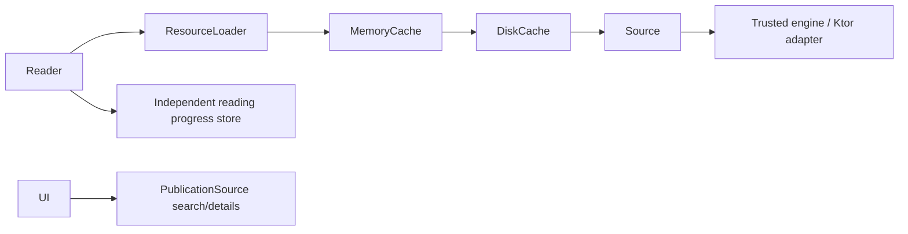

# Architecture

> A source obtains publications. A reader displays them. INFINILECT connects both.

## Foundation implemented today

Two modules are sufficient: `core` and `app`. Both use Kotlin Multiplatform source
sets, with JVM/desktop as the only configured targets. More targets and modules
will be introduced with working implementations, not empty placeholders.

`core/commonMain` contains Kotlin-only models and suspend contracts. It has no
Compose, Readium, Ktor, SQLDelight or platform dependency. `app/commonMain` owns the
welcome UI and `app/desktopMain` owns its launcher. The dependency direction is
`app → core`; core never refers to app.

## Domain

`SourceId` is a stable namespace. `PublicationId` is the structured pair of source
ID and local publication ID, so identical local IDs from different catalogs do
not collide. Do not flatten it with an unescaped separator in storage or URLs.
`PublicationType` describes meaning (BOOK, COMIC, MAGAZINE, ARTICLE, DOCUMENT).
`PublicationFormat` describes representation (EPUB, PDF, PAGES, HTML, TEXT).
A publication can offer multiple representations without changing semantic type.

`PublicationResource` is an opaque source-owned resource reference, with a
publication identity, unique resource key, format and media type. It is not a
filesystem path or a reader engine object. `Publication` enforces ownership and
resource-key uniqueness. Empty resources are valid for search metadata awaiting
detail retrieval. `PublicationSource` provides search, details and resource bytes;
its results must carry its namespace. Pagination tokens belong to the source.
Source implementations must reject foreign identities and preserve coroutine
cancellation. Error handling and payload limits will be implemented with the
first actual adapter rather than guessing a broad error hierarchy now.

## Intended reading flow (not implemented)

The application chooses a representation and reader implementation by format and
platform. A reader consumes publication metadata and `ResourceLoader`, never a
source adapter, OPDS parser, authentication client or catalog search interface.
The loader routes by SourceId and applies caching before its source fallback.
The initial ByteArray contract is intentionally small; introduce bounded streaming
when actual formats and payload measurements require it, without coupling core
to Ktor streams. Sources return metadata; readers render it. Neither owns the other.

Ktor belongs in a concrete trusted source/transport implementation outside core.
SQLDelight is deferred until persistent data needs a schema. Readium is deferred
and must remain behind an Android-specific reader implementation; no Readium
objects or dependencies may cross into core or shared reader contracts.

External source definitions will be declarative data interpreted by trusted
engines, not downloaded code. See [Sources](SOURCES.md). Cache, explicit downloads
and progress have separate lifetimes; see [Cache](CACHE.md).

No full reader, engine registry, persistence framework or cache implementation is
claimed by this foundational commit. See the [ADRs](adr/README.md).
